01

10年1000万计划20多岁上大学的时候，我爱瞎琢磨问题。我发现大多数人工作收入有较大的瓶颈，一般到了中高层，40岁左右，工作收入就很难再大幅提高了。而投资是复利增长，前期投资收入少。但越到后期，本金积累越多，投资能力积累越深，投资收入越来越高。比如巴菲特的资产增长曲线就很典型。

我在20多岁就比较坚定这个思想，经常给身边的人讲，之后一路摸索实践。刚开始什么都不懂，把生活费存在银行定期，多赚一点利息。后来我们那里政府下面的城投机构融资，10%的利率，我想把自己攒的钱投了进去，但人家要求最低5万，和家里人商量，让父母一起凑了5万投进去。第一年到期，利息赚了5000。当时第一次觉得赚的收益都够我大半年生活费了，用钱赚钱真爽。之后连续利滚利投资了4年，后面政府不需要融资了，这个路子就断了。

后来大学毕业，当时金融危机后不久，我们那里房价有了上涨的势头。当时看了很多专家的文章，都是不能买房，房子泡沫。后来还是我妈说，儿子大学毕业，要早点买房完成任务，把大部分积蓄拿出来买了一套房子，结果后面涨了。赚钱之后，引发了我浓厚的兴趣，我又深入研究房价，发现大部分专家都瞎扯淡，后面又攒钱买了1套房子，结婚时老婆陪嫁又买了一套房子，房子算是真正靠投资实打实赚到大钱的地方。

再后来就是P2P了。起初也是抱着试一试的态度，结果一开始就踩了雷。后来痛定思痛深入研究，之后再没踩什么大雷。长期的繁荣稳定，让我胆子越来越大，资金投入也越来越多。最高的时候有300多万，利息收入一年30多万。结果在我资金投入最多的时候，行业爆发危机，全行业覆没。当时觉得天都塌下来了，过去的收益全亏了不说，本金还折损不少。一年多时间我都昏昏沉沉，让我深深怀疑投资折腾有啥意义？


我开始对投资彻底的反思：我们到底赚的是谁的钱？风险到底怎么控制？到底怎么让投资可持续？经过彻底反思和过去的经验，

让我对底层资产有了更深入的理解。核心城市的房产和优质公司的股权才能长久增值，其他资产高收益都不可长期持续。

核心城市聚集了最优质的资源，比如最优质的人力资源，工作机会、医疗资源、教育资源。无数年轻人都向往留在核心城市。核心城市几乎永远都是国家经济的发动机，很少随着历史的变迁改变，其房价的增长速度快于其他资产。世界各国都如此。伦敦、纽约、巴黎过去房价都是长期上涨的，几乎没有例外。

优质公司往往垄断了一个行业的大部分资源，赚了行业大部分利润。一般利润增速是经济增速的2-3倍，而且可以长期稳定。所以优质公司的股权长期回报也很高，典型例子就是巴菲特，靠优质公司股权，成为了世界最有钱的人之一。

房产我已经买了比较多，下一步主要是把资产调整为股权资产

未来资产配置比例大概如下：

40%房产

35%股票

15%债券

5%现金和保险

5%港股打新和海外资产

目前我房子的价值有大几百万（包含210万房贷）。

后面我工作的收入用来还清房贷，维持日常开销，每年稳定的存钱。

房产以外其他资产大约不到300万，我准备用10年时间增值到1000万。

加上每年的存款，折算下来，大约需要每年8%-10%左右的收益。

到时候，加上房产，总资产大约2000万+，每年投资收入大约100-150万，维持以后的花销问题不大，我就准备退休了

退休之后，想去享受享受人生，看看这个美好的世界。

这是我想了很久的计划，未来肯定会遇到各种困难，但我会不断努力实现这个计划。

计划如何具体实施，主要是3点

（1）在股票便宜的时候分批买入（择时）
（2）选择优质基金，让专业的基金经理帮我们选择优秀的股票。（择股）
（3）股票和债券+银行存款滚动。股票贵的时候，定投债券基金和银行存款；股票便宜的时候，取出债券和银行存款，定投股票基金。这样资金可以永远滚动。


02

在股票便宜的时候分批买入（择时）

投资赚钱,就是在低位的绿色区域买入，在高位黄色的区域卖出。（如下图所示）

比如在2440点的附近分批买，长期持有，等市场哪天疯狂到5000点的时候，分批卖掉。3-5年一轮，盈利一般70%-100%左右，年化收益12%-15%左右。

我创业板就是这样买的，2018年10月份，大约2500点左右，分批买入。
拿了一年半，市场就热起来了，迎来了一小波科技股牛市，赚了72%左右，都卖了。


最关键的是怎么判断股市在绿色区域还是黄色区域的？或者说怎么知道股票是在低位还是高位？

主要看估值！

我说过很多次买股票的本质就是出资成为公司的股东，让公司替我们赚钱。


一般用投资收回成本的时间来衡量估值。如果你投资的股票市值1亿，每年利润1000万，意味着你的投资10年后能收回成本，行话叫10倍估值。

专业名词叫市盈率。【市盈率（PE）=股票市值/利润】

市盈率为10，意味着收回投资成本需要10年，市盈率为5，意味着收回投资成本需要5年，市盈率为1，意味着收回投资成本只需要1年。

一般来说收回投资的时间是稳定的。比如，沪深300背后的公司一般平均10年能收回成本，这个平均值是相对稳定的。

假设明年牛市来临，股价大涨一倍，市值变为了2亿，则20年后才能收回成本（20倍市盈率），比平均估值一下子高一倍，这就明显贵了，股市就处于高位。


如果后年熊市来袭，股价直接跌了一倍，跌到了5000万，则我们的投资5年就可以收回成本（5倍市盈率），比市场平均估值低一倍，明显便宜了，股市处于低位。

一般整体市场高位低位，比较合适的指标是看全市场等权的市盈率，或者市净率指标。我们对比市盈率走势图（下面第一张图）和股票的走势图（下面第二张图）：

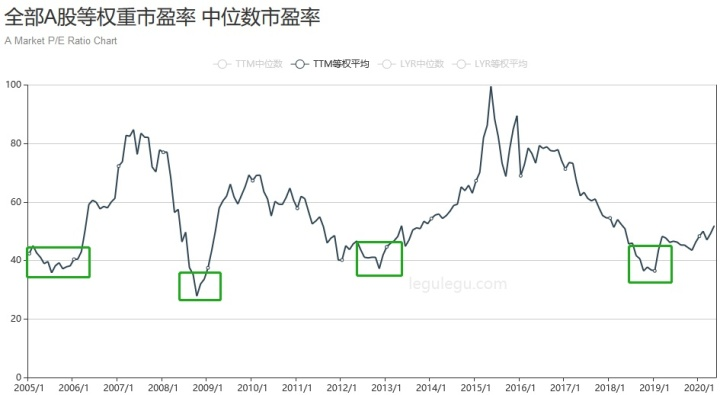


估值（市盈率）的底部，都是对应股价的底部。所以通过估值，我们就能判断市场在高位还是低位。

在便宜时机买入，就是在估值比历史上70%都便宜的时候分批买入（下图绿色区域），越跌越买；估值比历史上70%都贵的时候分配卖出（下图黄色区域），越贵越卖。

03

选择优质基金，让专业的基金经理帮我们选择优秀的股票。（择股）

我们普通人研究股票的难度还是很大的，需要研究行业、公司业务、财报等等。最好的办法还是选一个好基金，好基金会帮我们选出好股票。

怎么选出好基金其实也比较简单，也就是基本的常识。

# 第一步，选业绩持续优秀的基金基金，业绩代表一切。

巴菲特为何牛逼，因为业绩全球前几名。业绩最能证明基金的优秀程度。虽然过去业绩好并不代表未来业绩也一定好，但如果一只基金长期业绩优秀且稳定，那至少说明其综合能力中上等，未来业绩好的概率更大。就好比，一个常年考班级前五名的同学，下次考进班级前五名的概率会更大，一般最差也不会跌出前30名。

目前业内常用的筛选基金业绩的方法是：“4433法则”。

这个方法由台湾大学的两位教授提出，以长期、中期、短期业绩排名作为筛选依据，
认为同时符合4个筛选标准的基金，就是市场上的优质基金。

```
第一个4： 选择一年期业绩排名在同类基金中排前1/4的基金；
第二个4： 选择两年、三年、五年、今年以来业绩排名在同类基金中排前1/4的基金；
第一个3： 选择近6个月业绩排名在同类基金中排前1/3的基金；
第二个3： 选择近3个月业绩排名在同类基金中排前1/3的基金。

```
“4433”法“兼顾长中短期业绩”，可以选出业绩持续优秀的基金

# 第二步：选风险低的基金

基金的风险如何衡量，主要看下跌幅度。
```
A基金赚20%收益，最大下跌5%。
B基金赚20%收益，最大下跌80%。
```

虽然都是20%收益，买A基金，不会亏钱，一直赚钱，拿着很爽。
买B基金，最高亏损60%，100万最高亏60万，大多数人会彻底崩溃，割肉出局白白亏损。

我们很容易看出A基金比B基金风险低。

有学术研究显示，最大回撤在30%以内，散户通常可以接受；回撤30%～50%，人们会觉得损失惨重；如果跌掉50%～60%甚至更多的时候，大部分人就彻底崩溃，割肉出局白白亏损。


所以我们一般选最大回撤（从最高点下跌到最低点的幅度）在30%以内的基金。

# 第三步：选从业4年以上的成熟基金经理

投资行业水很深，学校里的理论知识学得再好，量化模型做得再出色，没经历过牛熊历练，人性考验，还是很难成长为一名优秀的基金经理的。一般4年是一个牛熊轮回，所以要选从业4年以上，经历过牛熊历练的基金经理。

此外要看基金经理过往业绩，优秀且稳定的过往业绩是一个基金经理能力最有效的证明，一般过往业绩在15%以上为佳。

# 第四步：选基金公司

每个基金公司都有自己擅长的领域。
有的基金公司擅长价值投资，比如：东方红，兴全基金，
而有的基金公司则更擅长成长股投资，比如：交银施罗德等，
最好选该基金公司擅长领域的明星基金。
各个基金公司的风格和侧重都是什么呢？

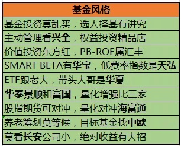

# 第五步：选基金规模、基金成立时间。

a 一般选5亿-50亿规模的主动基金

对于主动管理的偏股型基金：5亿-50亿的规模较好
规模过小对于业绩具有负面作用，像信息披露费、审计费、律师费等都是要固定支付的，规模过小的话分摊到单位份额上的成本就越高；

规模过大的话基金经理操作难度会加大，比如一个10亿的基金可能配置20只股票就够了，100亿的规模的话可能就需要配置100只甚至更多的股票，而A股市场优质的股票还是比较稀缺的，并且基金经理能跟踪的股票的数量也是有限的。一般来说，5亿-50亿对主动管理型基金来说是比较合适的规模。


b 选基金成立时间：至少成立3年以上

如果基金成立时间太短，说明运作还没有稳定，业绩没办法评估，很难区分这个基金的业绩是来自于运气还是实力。


# 第六步，深入调研首先，我们一定要去观察这个基金的历史持仓投资记录。

比如，对于价值型基金，你就要观察它的历史持仓记录里是不是总持有较多且表现优质的价值股。它的仓位偏好如何？仓位调整频率如何？是否有稳定行业偏好？是否有稳定的估值偏好，整体持股的估值水平是否比行业平均要高？

再就是要看这个基金经理的历史言论，
搜集基金经理发表的文章、接受采访以及公开发表的言论、基金公司的宣传材料等，查看他的投资逻辑、投资体系，看其和实际持仓、实际操作！

搞清楚它的业绩表现怎么样？——业绩表现
为什么业绩会是这样？——持仓记录（反映选股风格、行业偏好、操作风格等）
什么样的投资逻辑支撑了这个投资业绩？——基金经理的投资逻辑

最后，查看资深投资者、同行的评价。基金是个比较小的圈子，一般优秀的基金内行人普遍公认，明星基金更是如雷贯耳。

按照上面六步筛选基金，不敢保证一定能选出前5%的明星基金，但选出前20%的优秀基金还是可以的！

综合以上六步我们选出了一个比较优秀的基金组合

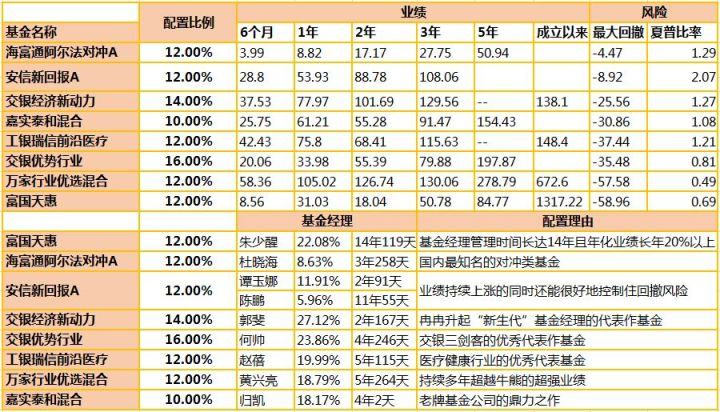

按照【风险平价】策略分配每只基金的比例。回测其2017-4-21~2020-3-12期间的业绩。


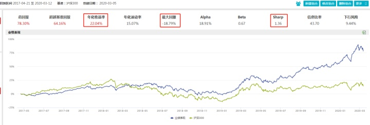

从上图我们可以看到回测的业绩，该组合在过去接近3年的时间（穿越牛熊，2018年大跌、2019年大涨）里取得了22%的高额年化回报率，业绩表现还是满意的。

04

股票和债券+银行存款滚动

让所有的钱永远滚动赚钱，我们叫做永动机策略。

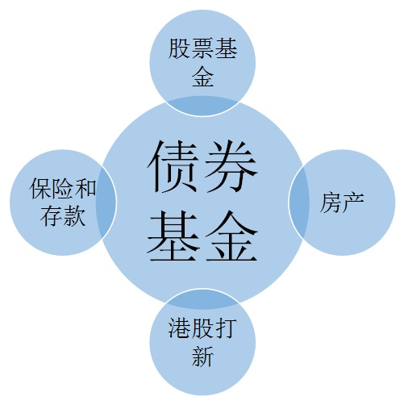

策略的中心是稳定回报的债券类基金，平均每年获取6%-8%左右的收益。每月用不到的钱，通过周定投存到债券基金。 这里可以积蓄大量的资金，等股票便宜的时候买入股票，越跌越买。股票基金预计赚取10%-15%的收益。

债券基金的买入方法：每周定投，不停止。周定投能降低波动低，还可以让资金非常灵活，如果需要，每周都有资金可以取出。 股票基金具体买入方法：如果股市比过去70%的时候都便宜，每周开始定投股票基金。如果股市比过去80%的时候都便宜，每周2倍定投股票基金。如果股市比过去90%的时候都便宜，每周3倍定投股票基金。


总体仓位都买到尽可能便宜的区域（如下图绿色所示）。等未来涨到黄色区域，我们逐步卖出。

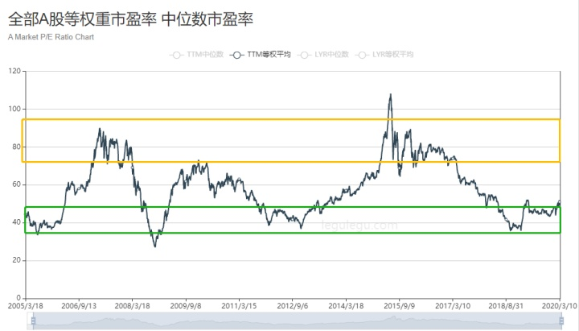

目前实盘持仓之前我有100多万资金已经投入另外几个账户实践，观察研究了很多策略。目前是我的策略优化到3.0，还有100万，我准备重新开一个账户。实盘分享我的投资思路和具体操作。有文字的记录，会让人思考更深入，操作更严谨。我会一直坚持并优化下去。目前的实盘如下：

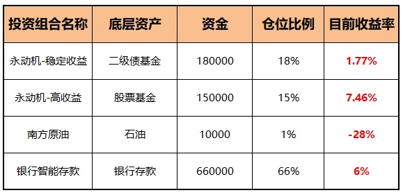

账户截图：

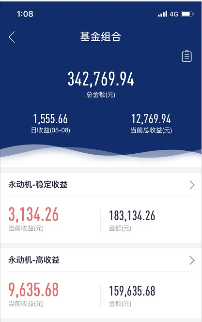

目前两个组合的投入节奏都是相对合适的，在市场剧烈下跌震荡的的过程中，缓慢的买入。

原油抄底买入被埋了，本来想后面再继续定投，结果原油基金全部限购，无法购买，只能在山腰上站岗。只能长期拿着等2-3年原油再涨回来卖了。

另外，浮动收益的特点就是会有浮亏，可能50%的时间都是亏损的，30%的时间微赚，20%的时间才是大赚的。大多是时候都是亏损很久，行情来了几天就赚30%-40%。所以大家看到浮亏不要害怕，慢慢适应浮动收益的特点。


06

下一步如何操作？

目前全部A股等权重中位数市盈率处于相对低位，比历史上70%的时候便宜。

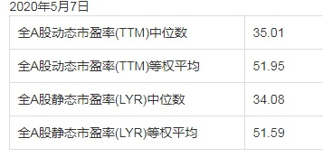

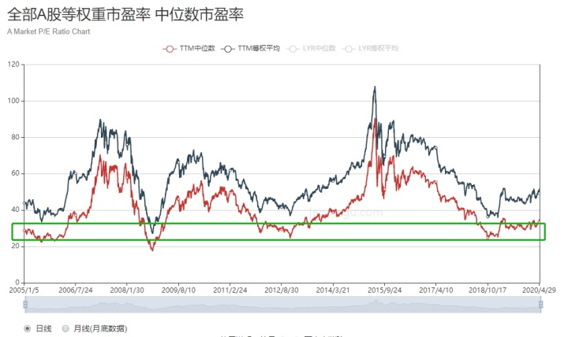

所以我们按计划买入，

现在比历史上70%的时候便宜，已经是我们买入的临界点，如果再涨，我们后面就不买了。

目前我们按计划1倍定投永动机-高收益，每周定投1万元。

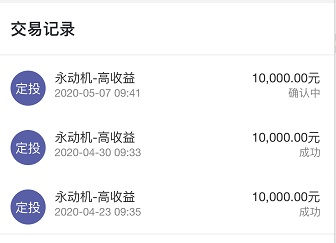

永动机-稳定收益底层资产是债券，能取得6%-8%的稳定收益，本期同样按计划稳定每周定投1万

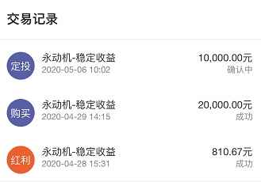

股市本身就是涨涨跌跌，和猪肉价格一样。现在相当于15块钱成本价的猪肉跌到了12块钱，仍然属于比较便宜的时候。如果没有极端情况，我们现在入手布局，未来几年，如果猪肉再涨到15块，我们就有50%-80%的盈利。

10年，1000万，就是这样一轮一轮布局-收获赚出来的。

# 风险提示

1、实盘适用于有投资经验，有一定的风险识别能力的朋友做参考。刚刚开始入门的朋友，建议先学习再考虑真金白银操作，否则很难承受浮亏，容易被割韭菜。

2、投资需要较长的周期，也有较小概率亏损，建议用闲钱投资，不要将生活费、婚嫁钱、养老金等必须使用的钱投入，这些钱一旦亏损会让生活陷入灾难。

3、投资没有100%，我们只能把握95%的大概率。对于黑天鹅、灰犀牛等小概率事件，没人能100%把握。所以建议大家资产合理配置，不要过度重仓。

[史上最全基金攻略：一篇文章彻底搞懂基金，再也不会亏钱](https://zhuanlan.zhihu.com/p/139487066)


